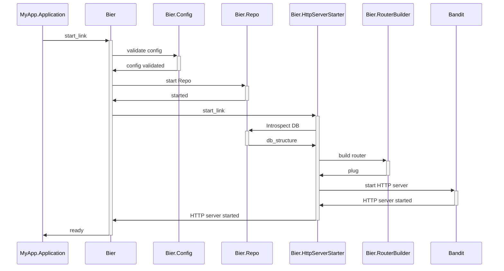
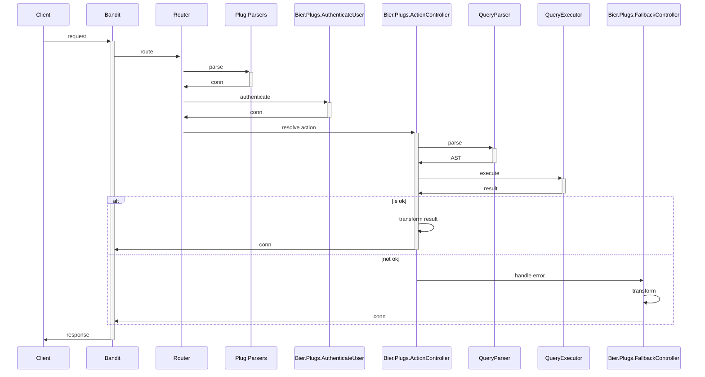

# Bier

**WARNING:** This project is in its first stage. Be aware this project may contain bugs or possibly security flaws. This implementation is **not** ready for production use.

## What is Bier?

A friend reached out today via Slack and caught me off base; our conversation went something like this:

> Him: what is bier  
> Me: hahaha  
> Him: you have to tell me  
> Me: it's like an urn :funeral_urn:  
> Him: hahahaha you butt  
> Him: WHAT IS THE ELIXIR LIBRARY YOU ARE PLAYING WITH IN YOUR OFFTIME THAT YOU NAMED BIER MILTON

So, I explained the basic idea to him, but now I wonder if he or other people want to know more details, so here I will offer a detailed explanation.

While Elixir is still my favorite programming language and primary interest. Since some time ago, I've been getting deeper into [PostgreSQL][]. It's a nice piece of software that constantly surprises you in good ways. Anyway, an exciting project would be to serve a RESTful API based on DB introspection, meaning that this library on the fly will introspect your DB and, based on the structure, constraints, and permissions, will build a RESTful API for you. This idea is not original; you probably already know about [PostgREST][], so this project is heavily inspired by that idea and my desire to explore more about [PostgreSQL][].

On the Elixir side, this project will allow me to explore some cool things; as I envision this project so far, those things are:

* Explore [Bandit][], as an HTTP server.
* Provide `Bier` as a supervisor so the library users can create as many instances as they need. It would be weird, but that's already implemented, and all the generated processes are registered via `Bier.Registry`.
* Before building the Router with `Bier.RouterBuilder`, we must call the DB and run queries to introspect the DB structure. Based on that structure, we will proceed to the next step.
* Build the Router directly with [Plug.Router](https://hexdocs.pm/plug/Plug.Router.html) and start [Bandit] programmatically in `Bier.HttpServerStarter`
* It's not clear to me at this point if we should create a migration to subscribe to possible changes in the DB (e.g., new tables) with something like `Postgrex.Notifications`, and once we catch those changes in `Bier.HttpServerStarter` rebuild the Router and inject that back to [Bandit][]
* Once we have the HTTP Server running, the incoming requests should end on what I call `Bier.Plugs.ActionController`; here, we should parse the queries into an internal AST using [NimbleParsec][], at this point, is not clear to me if that after the parsing phase, the execution should transform that AST into [Ecto][] Queries or just go straight with something like `Postgrex`. Based on the query's result, we should return the response to the client if it was successful. Otherwise, the flow will end with the `Bier.Plugs.FallbackController`.

To summarize, at this _alpha_ stage, I still have too many things to figure out, but I think that the following sequence diagram should wrap up the whole idea:

Then, once the HTTP server is ready, the incoming requests should follow this pattern:

Most of the interaction mentioned in the first sequence diagram is already working, except that I'm injecting a static "DB introspection" and static responses in the _ActionController_. There are still a lot of missing pieces and unit tests, but I think the hard thing to get right would be the _QueryParser_ and _QueryExecutor_. Also, the initial goal is to support only PostgreSQL because I don't have a special interest in other adapters now. Still, if the final _QueryExecutor_ reaches a stage where we can build and execute [Ecto][] Queries, we can delegate the adapter to Ecto. But I still need some time to explore this area.

I'm not too worried about the initial PostgreSQL introspection because `psql` already offers a starting point. If you start the client with the option `-E` or `--echo-hidden`, that option would echo the queries generated by `\d` and other backslash commands inside `psql`.

Hopefully, with all this now, you have a better overview of the goals of this project.

That's all for now. Please feel free to reach out if you want to discuss this further.

Happy Hacking!

[PostgreSQL]: https://www.postgresql.org
[PostgREST]: https://postgrest.org/en/stable/
[Bandit]: https://github.com/mtrudel/bandit
[NimbleParsec]: https://hexdocs.pm/nimble_parsec/NimbleParsec.html
[Postgrex]: https://hexdocs.pm/postgrex/readme.html
[Ecto]: https://hexdocs.pm/ecto
