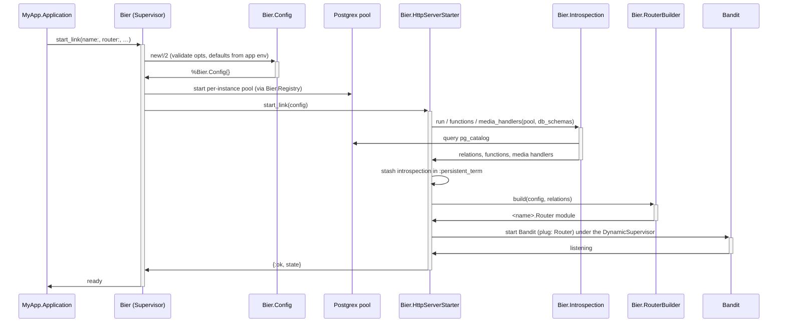
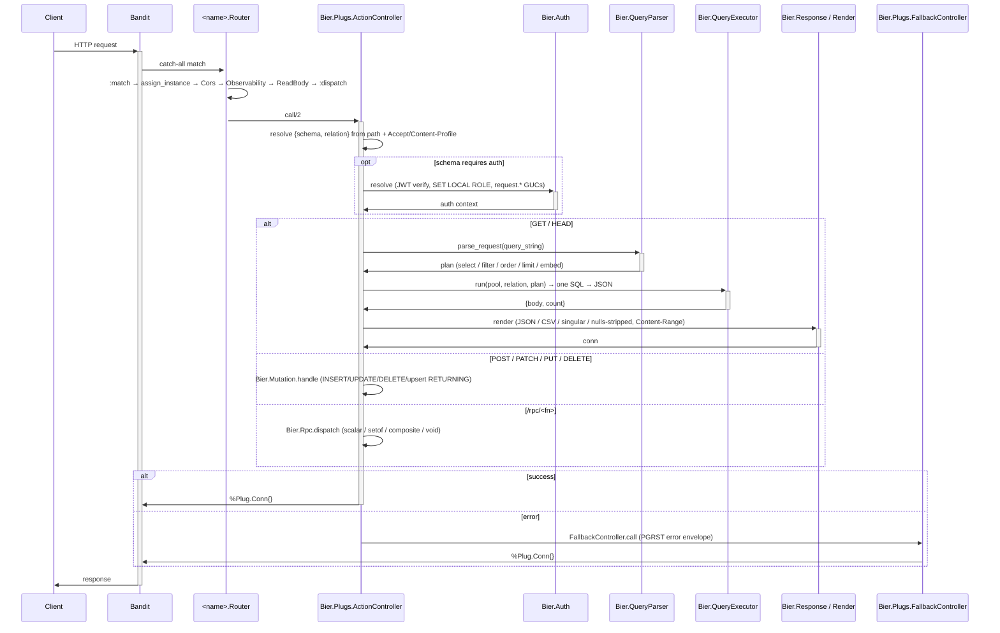

# Bier

> **Alpha.** Bier is in its first stage. Expect bugs and possibly security
> flaws — it is **not** ready for production use.

Bier is an Elixir library that serves a RESTful API generated **on the fly** from
PostgreSQL introspection: point it at a database and it inspects the tables,
views, functions, and foreign keys and exposes them over HTTP — no controllers,
no route files, no schema definitions to write. It is heavily inspired by
[PostgREST][], and tracks PostgREST's request/response behavior closely (see
[Conformance](#conformance)).

## How it works, in one paragraph

Each Bier instance is a supervision tree the host application starts. On boot it
opens a [Postgrex][] connection pool, introspects the configured schemas, builds
a [Plug.Router][] module at runtime, and starts a [Bandit][] web server with it.
Every incoming request is resolved to a `{schema, relation}` at request time and
compiled into **one** parameterized SQL statement that returns its result set as
JSON, which is then rendered in the negotiated media type.

## Installation

Not yet published to Hex. Add it as a git dependency:

```elixir
def deps do
  [
    {:bier, github: "milmazz/bier"}
  ]
end
```

Requires Elixir `~> 1.18` (developed against Elixir 1.19 / OTP 28) and a
reachable PostgreSQL instance. Bier pulls in [Bandit][], [Plug][], [Postgrex][],
and [NimbleOptions][] as runtime dependencies.

## Usage

Add a `Bier` child to your application's supervision tree. Each child is one
**named instance** with its own config, connection pool, and web server;
multiple instances coexist by passing distinct `:name` values.

```elixir
children = [
  {Bier,
   name: MyApp.Bier,
   router: [port: 4040, scheme: :http],
   database: "my_app_dev",
   username: "postgres",
   password: "postgres",
   db_schemas: ["api"]}
]

Supervisor.start_link(children, strategy: :one_for_one)
```

Once it is up, the database is reachable over HTTP, e.g.:

```sh
# read rows, filter, select columns, order, paginate
curl "http://localhost:4040/items?select=id,name&age=gte.18&order=name.asc&limit=10"

# insert and get the row back
curl -X POST "http://localhost:4040/items" \
  -H "Content-Type: application/json" \
  -H "Prefer: return=representation" \
  -d '{"name": "Ada"}'

# call a database function
curl "http://localhost:4040/rpc/add?a=1&b=2"
```

## Configuration

Options are validated by a [NimbleOptions][] schema (`Bier.schema/0`). Their
defaults are sourced from application env, so you can also set them under
`config :bier, …` instead of passing them to `start_link/1`. The main keys
(named after their PostgREST equivalents):

| Key | Default | Purpose |
|-----|---------|---------|
| `name` | `Bier` | Instance name; also the registry key and `<name>.Router` module. |
| `router` | `[port: 4040, scheme: :http]` | Bandit web-endpoint options. |
| `hostname` / `port` / `database` / `username` / `password` | `localhost` / `5432` / `bier` / — / — | Postgres connection. |
| `pool_size` | `10` | Per-instance Postgrex pool size. |
| `db_schemas` | `["public"]` | Ordered list of exposed schemas; the first is the default. |
| `db_anon_role` | `nil` | Role assumed for unauthenticated requests. |
| `db_extra_search_path` | `["public"]` | Extra schemas appended to the search path. |
| `db_max_rows` | `nil` | Cap on rows returned per request. |
| `db_tx_end` | `:commit` | End each request's transaction with `:commit` or `:rollback`. |
| `db_pre_request` | `nil` | Function run inside every request transaction before the main query. |
| `jwt_secret` / `jwt_aud` | `nil` | JWT verification secret and expected audience (HS256). |
| `server_cors_allowed_origins` | `nil` | Comma-separated CORS allow-list. |
| `server_timing_enabled` | `false` | Emit a `Server-Timing` header. |
| `server_trace_header` | `nil` | Request header (e.g. `X-Request-Id`) echoed on the response. |
| `log_level` | `:error` | Access-log verbosity. |
| `openapi_mode` | `"follow-privileges"` | How the root OpenAPI document is served. |

See `Bier.schema/0` for the complete, documented list.

### Pluggable JSON

`Bier.json_library/0` returns the configured encoder (the stdlib `JSON` module by
default, which requires Elixir 1.18+). Override it with:

```elixir
config :bier, :json_library, Jason
```

## Architecture

There are two supervisors with different jobs. `Bier.Application` (the OTP `mod:`)
starts only `Bier.Registry`, a process registry shared by every Bier instance in
the node — it does **not** start a web server. `Bier` itself is the per-instance
`Supervisor` the host application starts; each instance owns its config, its
Postgrex pool, a `DynamicSupervisor`, and a dynamically generated router module.

### Boot flow


```mermaid
sequenceDiagram
    participant A as MyApp.Application
    participant B as Bier (Supervisor)
    participant C as Bier.Config
    participant P as Postgrex pool
    participant E as Bier.HttpServerStarter
    participant I as Bier.Introspection
    participant F as Bier.RouterBuilder
    participant G as Bandit
    A->>+B: start_link(name:, router:, …)
    B->>+C: new!/2 (validate opts, defaults from app env)
    C->>-B: %Bier.Config{}
    B->>P: start per-instance pool (via Bier.Registry)
    B->>+E: start_link(config)
    E->>+I: run / functions / media_handlers(pool, db_schemas)
    I->>P: query pg_catalog
    I->>-E: relations, functions, media handlers
    E->>E: stash introspection in :persistent_term
    E->>+F: build(config, relations)
    F->>-E: <name>.Router module
    E->>+G: start Bandit (plug: Router) under the DynamicSupervisor
    G->>-E: listening
    E->>-B: {:ok, state}
    B->>-A: ready
```

`Bier.RouterBuilder.build/2` creates the router with `Module.create/3` at runtime,
named `<name>.Router`. It is a thin **catch-all**: every request flows through a
fixed plug pipeline (`:match` → `assign_instance` → `Bier.Plugs.Cors` →
`Bier.Plugs.Observability` → `Bier.Plugs.ReadBody` → `:dispatch`) and is then
forwarded to `Bier.Plugs.ActionController`. Because the router is regenerated on
every boot it is not checked in, and grepping for routes will not find them — edit
the quoted block in `RouterBuilder` instead.

### Request flow


```mermaid
sequenceDiagram
    participant C as Client
    participant G as Bandit
    participant R as <name>.Router
    participant AC as Bier.Plugs.ActionController
    participant AU as Bier.Auth
    participant QP as Bier.QueryParser
    participant QE as Bier.QueryExecutor
    participant RN as Bier.Response / Render
    participant FC as Bier.Plugs.FallbackController
    C->>+G: HTTP request
    G->>+R: catch-all match
    R->>R: :match → assign_instance → Cors → Observability → ReadBody → :dispatch
    R->>+AC: call/2
    AC->>AC: resolve {schema, relation} from path + Accept/Content-Profile
    opt schema requires auth
        AC->>+AU: resolve (JWT verify, SET LOCAL ROLE, request.* GUCs)
        AU->>-AC: auth context
    end
    alt GET / HEAD
        AC->>+QP: parse_request(query_string)
        QP->>-AC: plan (select / filter / order / limit / embed)
        AC->>+QE: run(pool, relation, plan) → one SQL → JSON
        QE->>-AC: {body, count}
        AC->>+RN: render (JSON / CSV / singular / nulls-stripped, Content-Range)
        RN->>-AC: conn
    else POST / PATCH / PUT / DELETE
        AC->>AC: Bier.Mutation.handle (INSERT/UPDATE/DELETE/upsert RETURNING)
    else /rpc/<fn>
        AC->>AC: Bier.Rpc.dispatch (scalar / setof / composite / void)
    end
    alt success
        AC->>-G: %Plug.Conn{}
    else error
        AC->>FC: FallbackController.call (PGRST error envelope)
        FC->>G: %Plug.Conn{}
    end
    G->>-C: response
```

`ActionController` resolves the target and method, runs the read/mutation/RPC
path, and lets any non-`Plug.Conn` return value fall through to
`Bier.Plugs.FallbackController`, which maps internal reasons and Postgres
`SQLSTATE`s to HTTP statuses and PostgREST's `{code, message, details, hint}`
error envelope.

### The query parser

`Bier.QueryParser` is a **generated**, dependency-free module built from its
`lib/bier/query_parser.ex.exs` template via `mix gen.parsers` (which runs
`mix nimble_parsec.compile`). `nimble_parsec` is a dev/test-only dependency —
the shipped code does not depend on it at runtime. Edit the `.ex.exs` template
and regenerate; never edit the generated `.ex` directly.

## Conformance

Bier is developed against a frozen conformance suite derived from PostgREST
**v14.12**: 532 cases spanning URL grammar, operators, select/embedding, filters,
ordering, pagination, representations, mutations, RPC, auth, errors, headers,
content negotiation, OpenAPI, config, observability, and domain representations.
PostgREST is the ground truth — each case cites the exact upstream source line.

Roughly 400 of the ~475 active cases pass today; most of the remainder are bound
by the frozen test harness or the local environment rather than by Bier itself.
The `spec/` tree (behavior models + `COVERAGE.md`) and `docs/CONFORMANCE_IMPL.md`
document the model and the build. Known feature gaps are tracked as GitHub issues
(observability/telemetry, schema-cache reload, admin/health endpoints, …).

## Development

```sh
mix deps.get
mix compile
mix test            # boots a local Postgres fixture DB, then runs the suite
mix format
mix gen.parsers     # regenerate the parser modules after editing a *.ex.exs template
```

Run every CI gate before pushing with:

```sh
mix precommit
```

which chains, in order: `mix deps.unlock --check-unused`,
`mix format --check-formatted`, `mix hex.audit`,
`mix compile --warnings-as-errors`, `mix credo --strict`,
`mix docs --warnings-as-errors`, and `mix test`. (CI runs the same steps
individually so each gate reports separately.)

The test suite loads `spec/conformance/fixtures.sql` into a local `bier_test`
database; see `docs/CONFORMANCE_IMPL.md` for the database wiring, and
[CONTRIBUTING.md](CONTRIBUTING.md) for the full contributor guide.

## Why "Bier"?

A friend asked what this side project was. I told him it's "like an urn" 🏺 —
a *bier* is the stand a coffin rests on. He was not amused. The name stuck. The
real motivation is more cheerful: Elixir is my favorite language, I keep falling
deeper into [PostgreSQL][], and serving a REST API straight from database
introspection is a great excuse to explore both — plus [Bandit][], [Plug][],
runtime module generation, and a parser built with [NimbleParsec][].

Happy hacking!

[PostgreSQL]: https://www.postgresql.org
[PostgREST]: https://postgrest.org/en/v14/
[Bandit]: https://github.com/mtrudel/bandit
[Plug]: https://hexdocs.pm/plug
[Plug.Router]: https://hexdocs.pm/plug/Plug.Router.html
[Postgrex]: https://hexdocs.pm/postgrex/readme.html
[NimbleOptions]: https://hexdocs.pm/nimble_options
[NimbleParsec]: https://hexdocs.pm/nimble_parsec/NimbleParsec.html
